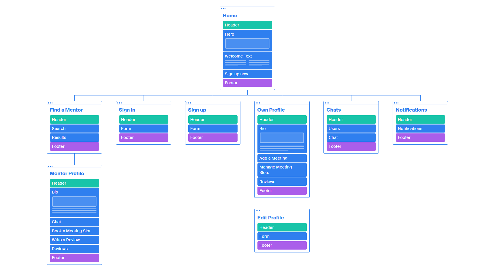
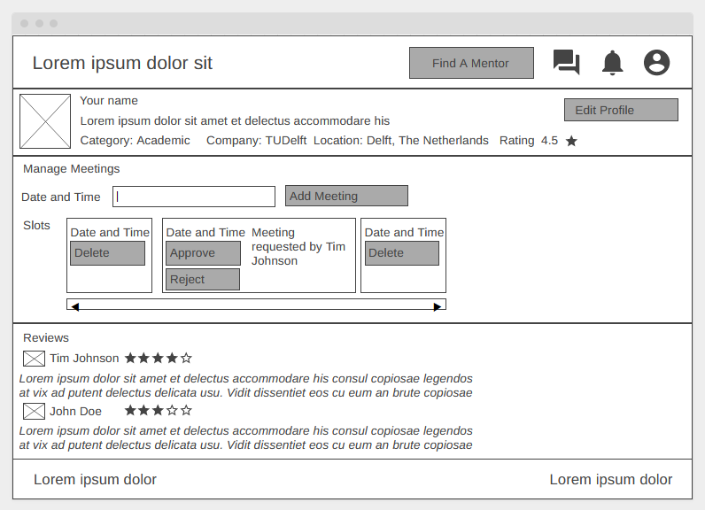
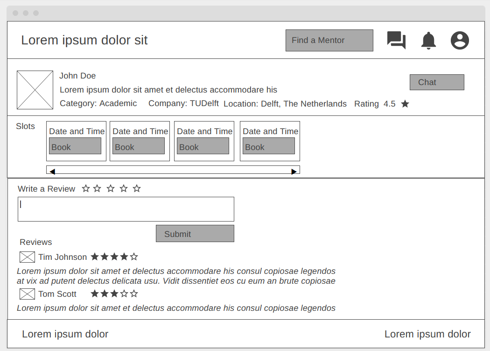
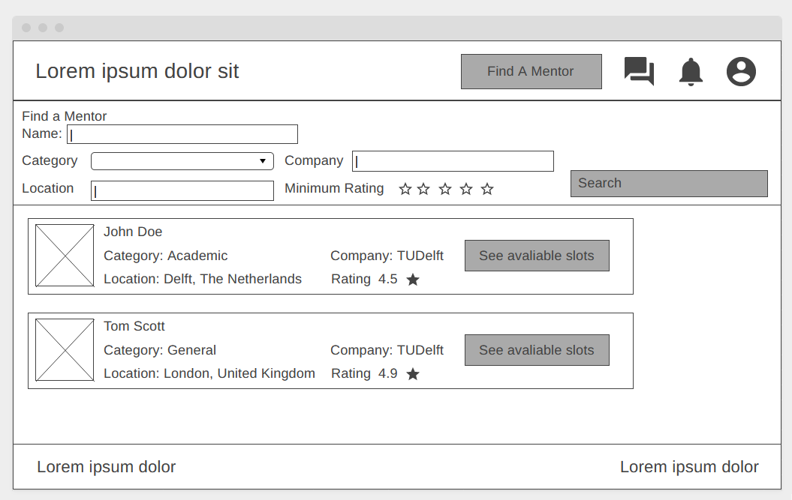
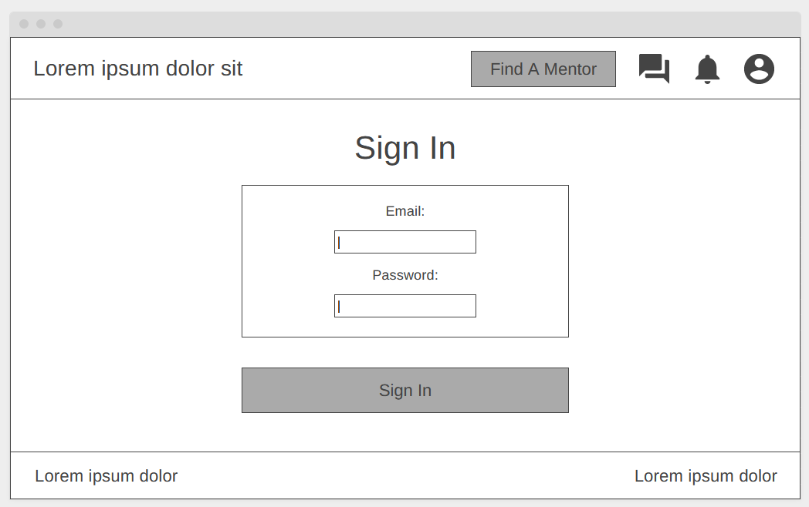
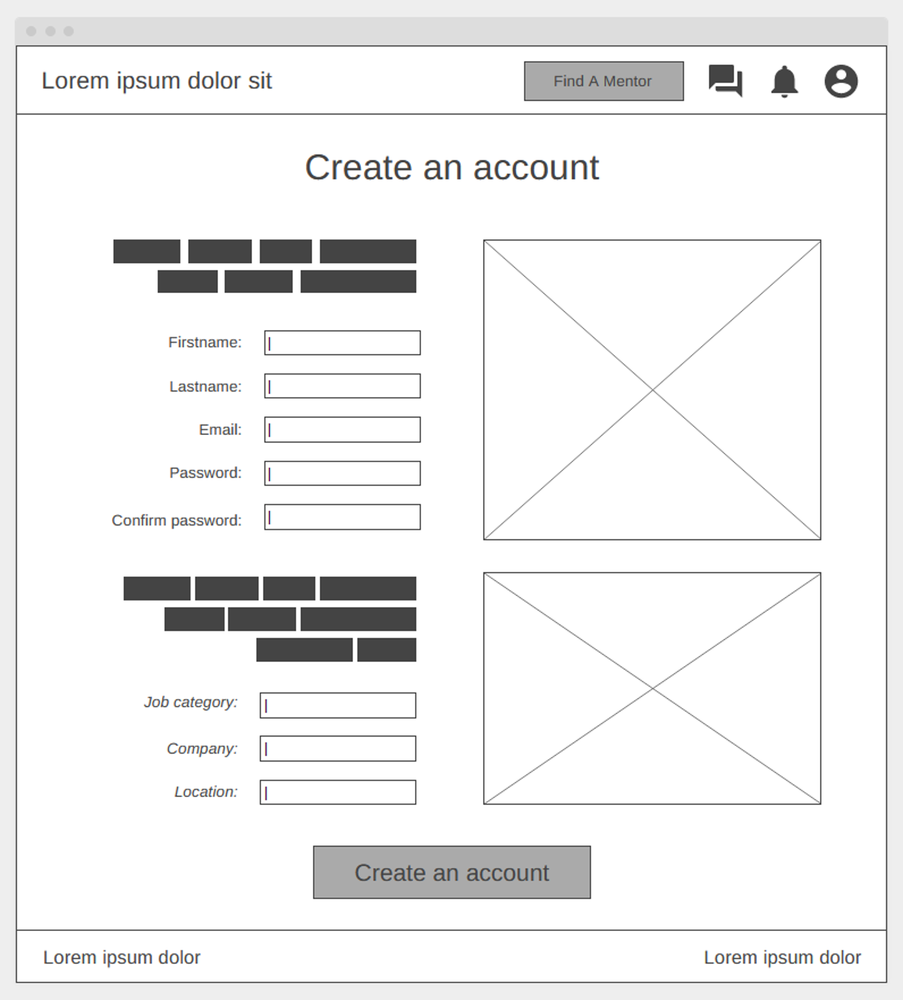
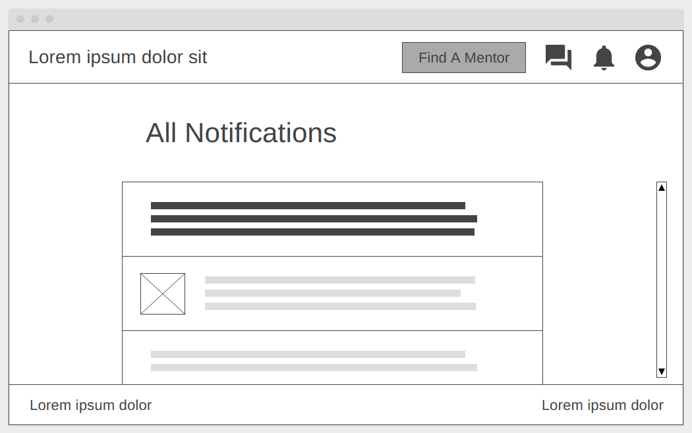
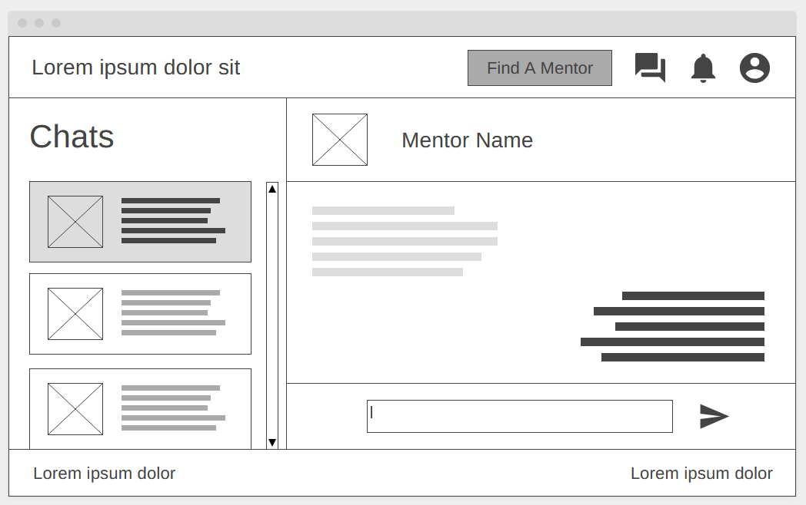
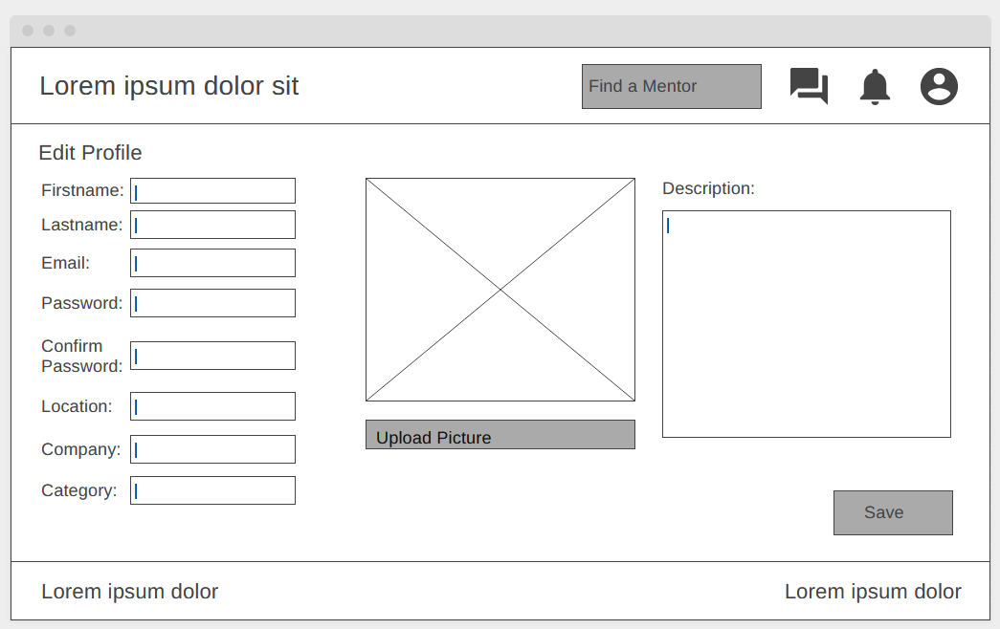

# Link to Live Website
https://vesk4000.github.io/Mentorate/index.html

# Requirements

| Requirement number | Description | Contributor Name |
|---|---|---|
| 1 | There should be a sign-up and sign-in feature for both mentors and mentees. | Aleksandra Savova |
| 2 | The mentors can provide available slots for meetings that will be displayed next to their profile picture when a mentee searches for a mentor ( for example, available on Thursday at 9:00 AM and Friday at 10:00 AM).  | Aleksandra Savova |
| 3 | Mentees should be able to search for mentors based on their skills or job category, company, review scores, and location. | Veselin Mitev |
| 4 | The mentees will first book the meeting from the website. The booking will be confirmed when the mentors accept the meeting request. In the meeting request, the mentors will enter the purpose of the meeting and select the available dates (as mentioned in point 2). | Veselin Mitev |
| 5 | This project's mode of communication between mentors and mentees is a simple text-based chat. | Aleksandra Savova |
| 6 | Mentees will receive reward points after each successful meeting. | Veselin Mitev |
| 7 | Mentees can vote for mentors (upvotes) and provide reviews for them (score out of five and description). | Aleksandra Savova |
| 8 | The application will send a simple push notification 15 minutes before the meeting in a browser. | Veselin Mitev |

# Sitemap


# Wireframes
## Home


## Profile


## Other Users


## Find a Mentor


## Sign In


## Sign Up


## Notifications


## Chats


## Edit Profile


# Source Code
## /index.html
```html
<!DOCTYPE html>
<html lang="en">

<head>
	<meta charset="UTF-8">
	<meta name="viewport" content="width=device-width, initial-scale=1.0">
	<title>Mentorate</title>
	<link rel="stylesheet" href="./src/style.css">
</head>

<body>
	<header class="header">
		<div class="logo">
			<a class="name" href="./index.html">Mentorate</a>
		</div>
		<div class="nav">
			<div class="button">
				<a class="text" href="./src/search.html">
					Find A Mentor
				</a>
			</div>
			<div>
				<a href="./chat.html">
					
				</a>
			</div>
			<div>
				<a href="./notifications.html">
					
				</a>
			</div>
			<div>
				<a href="./src/profile.html">
					
				</a>
			</div>
			<div class="button">
				<a class="text" href="./signIn.html">
					Sign In
				</a>
			</div>
		</div>
	</header>
	<div class="heroHome">
		
		<div class="hero-innerHome">
			<h1 class="h1">Our Mission</h1>
			<p class="welcomeText">Lorem ipsum dolor sit amet consectetur adipisicing elit. Fugiat nesciunt accusantium
				tempora voluptatem velit enim quaerat sapiente sed, repellat temporibus eaque dignissimos, saepe ab
				recusandae incidunt fuga veniam vero vitae!</p>
			<div class="container">
				<a href="./signUp.html" class="button2 text">Sign Up Now</a>
			</div>
		</div>
	</div>
	<footer class="footer">
		<div class="logo">
			<a class="name" href="./index.html">Mentorate</a>
		</div>
		<div class="text">
			Created by: Veselin Mitev and Aleksandra Savova
		</div>
	</footer>
</body>

</html>
```

## /chat.html
```html
<!DOCTYPE html>
<html lang="en">

<head>
	<meta charset="UTF-8">
	<meta name="viewport" content="width=device-width, initial-scale=1.0">
	<title>Mentorate</title>
	<link rel="stylesheet" href="./src/style.css">
</head>

<body>
	<header class="header">
		<div class="logo">
			<a class="name" href="./index.html">Mentorate</a>
		</div>
		<div class="nav">
			<div class="button">
				<a class="text" href="./src/search.html">
					Find A Mentor
				</a>
			</div>
			<div>
				<a href="./chat.html">
					
				</a>
			</div>
			<div>
				<a href="./notifications.html">
					
				</a>
			</div>
			<div>
				<a href="./src/profile.html">
					
				</a>
			</div>
			<div class="button">
				<a class="text" href="./signIn.html">
					Sign In
				</a>
			</div>
		</div>
	</header>
	<div class="hero-chat">
		<div class="chats">
			<div class="chat-header2">
				<h1 class="h1-chat">Chats</h1>
			</div>
			<div class="user-chat-current">
				
				<p class="username-chat-text">Jane Doe</p>
			</div>

			<div class="user-chat">
				
				<p class="username-chat-text">John Doe</p>
			</div>

			<div class="user-chat">
				
				<p class="username-chat-text">Jamy Roe</p>
			</div>

			<div class="user-chat">
				
				<p class="username-chat-text">Jane Roe</p>
			</div>
		</div>
		<div class="opened">
			<div class="chat-header">
				
				<h1 class="username-chat-text">Jane Doe</h1>
			</div>
			<div class="messages">
				<div class="other-message">
					
					<p>Lorem ipsum dolor sit amet consectetur adipisicing elit. Fugiat nesciunt accusantium tempora
						voluptatem velit enim quaerat sapiente.</p>
				</div>
				<div class="my-message">
					<p>Lorem ipsum dolor sit amet consectetur adipisicing elit. Fugiat nesciunt accusantium tempora
						voluptatem velit enim quaerat sapiente.</p>
				</div>
			</div>
			<div class="chat-footer">
				<form action="">
					<input class="textbox chatbox" type="text" name="message">
				</form>
				
			</div>
		</div>
	</div>
	<footer class="footer">
		<div class="logo">
			<a class="name" href="./index.html">Mentorate</a>
		</div>
		<div class="text">
			Created by: Veselin Mitev and Aleksandra Savova
		</div>
	</footer>
</body>

</html>
```

## /notifications.html
```html
<!DOCTYPE html>
<html lang="en">

<head>
	<meta charset="UTF-8">
	<meta name="viewport" content="width=device-width, initial-scale=1.0">
	<title>Mentorate</title>
	<link rel="stylesheet" href="./src/style.css">
</head>

<body>
	<header class="header">
		<div class="logo">
			<a class="name" href="./index.html">Mentorate</a>
		</div>
		<div class="nav">
			<div class="button">
				<a class="text" href="./src/search.html">
					Find A Mentor
				</a>
			</div>
			<div>
				<a href="./chat.html">
					
				</a>
			</div>
			<div>
				<a href="./notifications.html">
					
				</a>
			</div>
			<div>
				<a href="./src/profile.html">
					
				</a>
			</div>
			<div class="button">
				<a class="text" href="./signIn.html">
					Sign In
				</a>
			</div>
		</div>
	</header>
	<div class="hero">
		<div class="hero-inner">
			<h1 class="h1">All notifications</h1>
			<div class="user-chat-current">
				
				<p class="username-chat-text">Jane Doe has requested a meeting.</p>
			</div>

			<div class="user-chat">
				
				<p class="username-chat-text">John Doe wrote a review.</p>
			</div>

			<div class="user-chat">
				
				<p class="username-chat-text">Jamy Roe gave you a rating of 4.</p>
			</div>

			<div class="user-chat">
				
				<p class="username-chat-text">Jane Roe has requested a meeting.</p>
			</div>
		</div>
	</div>
	<footer class="footer">
		<div class="logo">
			<a class="name" href="./index.html">Mentorate</a>
		</div>
		<div class="text">
			Created by: Veselin Mitev and Aleksandra Savova
		</div>
	</footer>
</body>

</html>
```

## /signIn.html
```html
<!DOCTYPE html>
<html lang="en">

<head>
	<meta charset="UTF-8">
	<meta name="viewport" content="width=device-width, initial-scale=1.0">
	<title>Mentorate</title>
	<link rel="stylesheet" href="./src/style.css">
</head>

<body>
	<header class="header">
		<div class="logo">
			<a class="name" href="./index.html">Mentorate</a>
		</div>
		<div class="nav">
			<div class="button">
				<a class="text" href="./src/search.html">
					Find A Mentor
				</a>
			</div>
			<div>
				<a href="./chat.html">
					
				</a>
			</div>
			<div>
				<a href="./notifications.html">
					
				</a>
			</div>
			<div>
				<a href="./src/profile.html">
					
				</a>
			</div>
			<div class="button">
				<a class="text" href="./signIn.html">
					Sign In
				</a>
			</div>
		</div>
	</header>
	<div class="hero">
		<div class="hero-inner">
			<h1 class="h1">Sign In</h1>
			<div class="signInContainer">
				<form class="form" action="">
					<label class="label" for="">Email: <br></label><input class="textbox" type="email" name="email">
					<br>
					<label class="label" for="">Password: <br></label> <input class="textbox" type="password"
						name="password" id=""> <br>
				</form>
			</div>
			<div class="container">
				<a href="./index.html" class="button2 text">Sign In</a>
			</div>
		</div>
	</div>
	<footer class="footer">
		<div class="logo">
			<a class="name" href="./index.html">Mentorate</a>
		</div>
		<div class="text">
			Created by: Veselin Mitev and Aleksandra Savova
		</div>
	</footer>
</body>

</html>
```

## /signUp.html
```html
<!DOCTYPE html>
<html lang="en">

<head>
	<meta charset="UTF-8">
	<meta name="viewport" content="width=device-width, initial-scale=1.0">
	<title>Mentorate</title>
	<link rel="stylesheet" href="./src/style.css">
</head>

<body>
	<header class="header">
		<div class="logo">
			<a class="name" href="./index.html">Mentorate</a>
		</div>
		<div class="nav">
			<div class="button">
				<a class="text" href="./src/search.html">
					Find A Mentor
				</a>
			</div>
			<div>
				<a href="./chat.html">
					
				</a>
			</div>
			<div>
				<a href="./notifications.html">
					
				</a>
			</div>
			<div>
				<a href="./src/profile.html">
					
				</a>
			</div>
			<div class="button">
				<a class="text" href="./signIn.html">
					Sign In
				</a>
			</div>
		</div>
	</header>
	<div class="hero">
		<div class="hero-inner">
			<h1 class="h1">Create an account</h1>
			<div class="signUpContainer">
				<div class="requiredFields">
					<form class="formSignUp" action="">
						<p class="caption">Fill out the following form to register. </p>
						<label class="label" for="">Firstname: </label><input class="textbox" type="text"
							name="firstname"> <br>
						<label class="label" for="">Lastname: </label><input class="textbox" type="text"
							name="lastname"> <br>
						<label class="label" for="">Email: </label><input class="textbox" type="email" name="email">
						<br>
						<label class="label" for="">Password: </label> <input class="textbox" type="password"
							name="password" id=""> <br>
						<label class="label" for="">Confirm password: </label> <input class="textbox" type="password"
							name="password" id=""> <br>
					</form>
					
				</div>
				<div class="optionalFields">
					<form class="formSignUp" action="">
						<p class="caption">Want to become a mentor? Help your students get to know you by filling the
							information below. </p>
						<label class="label optional" for="">Job category: </label><input class="textbox" type="text"
							name="job"> <br>
						<label class="label optional" for="">Company: </label><input class="textbox" type="text"
							name="company"> <br>
						<label class="label optional" for="">Location: </label><input class="textbox" type="text"
							name="location"> <br>
					</form>
					
				</div>
			</div>
			<div class="container">
				<a href="./index.html" class="button2 text">Create an account</a>
			</div>
		</div>
	</div>
	<footer class="footer">
		<div class="logo">
			<a class="name" href="./index.html">Mentorate</a>
		</div>
		<div class="text">
			Created by: Veselin Mitev and Aleksandra Savova
		</div>
	</footer>
</body>

</html>
```

## /src/user.html
```html
<!DOCTYPE html>
<html lang="en">

<head>
	<meta charset="UTF-8">
	<meta name="viewport" content="width=device-width, initial-scale=1.0">
	<title>Mentorate</title>
	<link rel="stylesheet" href="./src/style.css">
</head>

<body>
	<header class="header">
		<div class="logo">
			<a class="name" href="./index.html">Mentorate</a>
		</div>
		<div class="nav">
			<div class="button">
				<a class="text" href="./src/search.html">
					Find A Mentor
				</a>
			</div>
			<div>
				<a href="./chat.html">
					
				</a>
			</div>
			<div>
				<a href="./notifications.html">
					
				</a>
			</div>
			<div>
				<a href="./src/profile.html">
					
				</a>
			</div>
			<div class="button">
				<a class="text" href="./signIn.html">
					Sign In
				</a>
			</div>
		</div>
	</header>
	<div class="content">
		<div class="content-box">
			<div class="profile-bio">
				
				<div class="profile-bio-contents">
					<div class="profile-bio-contents-name">
						<h2>Tom Scott</h2>
						<a class="profile-bio-contents-name-edit" href = "./chat.html">Chat</a>
					</div>
					<em>Description... Lorem ipsum dolor sit amet, consectetur adipiscing elit. Aliquam pellentesque
						risus non viverra pretium.</em>
					<p></p>
					<div class="profile-bio-contents-rest">
						<div>Category: <strong>General</strong></div>
						<div>Company: <strong>None</strong></div>
						<div>Location: <strong>London, The United Kingdom</strong></div>
						<div>Rating: <strong>5.0★</strong></div>
					</div>
				</div>
			</div>
		</div>
		<div class="content-box">
			<h4>Meeting Slots:</h4>
			<div class="profile-meeting-slots">
				<div class="profile-meeting-slot">
					<div class="profile-meeting-slot-el">Tuesday, 7 February 2023, 9:00</div>
					<button class="profile-button">Book</button>
				</div>
				<div class="profile-meeting-slot">
					<div class="profile-meeting-slot-el">Tuesday, 7 February 2023, 9:00</div>
					<button class="profile-button">Book</button>
				</div>
				<div class="profile-meeting-slot">
					<div class="profile-meeting-slot-el">Tuesday, 7 February 2023, 15:00</div>
					<button class="profile-button">Book</button>
				</div>
			</div>
		</div>
		<div class="content-box">
			<h3>Write a Review:</h3>
			<form>
				<button class="star-button">☆</button>
				<button class="star-button">☆</button>
				<button class="star-button">☆</button>
				<button class="star-button">☆</button>
				<button class="star-button">☆</button>
				<input type="submit" class="profile-button" value="Submit">
				<p></p>
				<textarea class="profile-textbox"></textarea>
			</form>

			<h3>Reviews</h3>
			<div class="profile-review">
				
				Howard Hamlin
				★★★★☆
				<p>Lorem ipsum dolor sit amet, consectetur adipiscing elit. Aenean quis justo vitae nisi vulputate
					tempor sed at arcu. Curabitur orci magna, lacinia vel turpis quis, tincidunt eleifend diam. Proin
					pharetra tellus arcu, sit amet lobortis turpis ultrices ac.</p>
			</div>
			<hr>
			<div class="profile-review">
				
				Chuck McGill
				★★★★★
				<p>Lorem ipsum dolor sit amet, consectetur adipiscing elit. Nullam vehicula orci nibh, eu ullamcorper
					ligula tempus non. Nulla quis nibh eget augue facilisis scelerisque non viverra neque. </p>
			</div>
		</div>
	</div>
	<footer class="footer">
		<div class="logo">
			<a class="name" href="./index.html">Mentorate</a>
		</div>
		<div class="text">
			Created by: Veselin Mitev and Aleksandra Savova
		</div>
	</footer>
</body>

</html>
```

## /src/search.html
```html
<!DOCTYPE html>
<html lang="en">

<head>
	<meta charset="UTF-8">
	<meta name="viewport" content="width=device-width, initial-scale=1.0">
	<title>Mentorate</title>
	<link rel="stylesheet" href="./src/style.css">
</head>

<body>
	<header class="header">
		<div class="logo">
			<a class="name" href="./index.html">Mentorate</a>
		</div>
		<div class="nav">
			<div class="button">
				<a class="text" href="./src/search.html">
					Find A Mentor
				</a>
			</div>
			<div>
				<a href="./chat.html">
					
				</a>
			</div>
			<div>
				<a href="./notifications.html">
					
				</a>
			</div>
			<div>
				<a href="./src/profile.html">
					
				</a>
			</div>
			<div class="button">
				<a class="text" href="./signIn.html">
					Sign In
				</a>
			</div>
		</div>
	</header>
	<div class="content">
		<div class="content-box">
			<h3>Find a Mentor</h3>
			<form class="search-form">
				<div>
					<label for="search-name">Name</label>
					<input type="text" id="search-name">
				</div>
				<div>
					<label for="search-category">Category</label>
					<select name="search-category" id="search-category">
						<option value="any">Any</option>
						<option value="academic">Academic</option>
						<option value="general">General</option>
						<option value="legal">Legal</option>
						<option value="lifestyle">Life Style</option>
					</select>
				</div>
				<div>
					<label for="search-company">Company</label>
					<input type="text" id="search-company">
				</div>
				<div>
					<label for="search-location">Location</label>
					<input type="text" id="search-location">
				</div>
				<div>
					<label>Minimum Rating</label>
					<button class="star-button">☆</button>
					<button class="star-button">☆</button>
					<button class="star-button">☆</button>
					<button class="star-button">☆</button>
					<button class="star-button">☆</button>
				</div>
				<input type="submit" value="Search" class="profile-button">
			</form>
		</div>
		<div class="content-box">
			<div class="profile-bio">
				
				<div class="profile-bio-contents">
					<div class="profile-bio-contents-name">
						<h2>Tom Scott</h2>
						<a class="profile-bio-contents-name-edit" href = "./src/user.html">Book a Meeting</a>
					</div>
					<div class="profile-bio-contents-rest">
						<div>Category: <strong>General</strong></div>
						<div>Company: <strong>None</strong></div>
						<div>Location: <strong>London, The United Kingdom</strong></div>
						<div>Rating: <strong>5.0★</strong></div>
					</div>
				</div>
			</div>
		</div>
		<div class="content-box">
			<div class="profile-bio">
				
				<div class="profile-bio-contents">
					<div class="profile-bio-contents-name">
						<h2>Jimmy McGill</h2>
						<a class="profile-bio-contents-name-edit" href = "./src/user.html">Book a Meeting</a>
					</div>
					<div class="profile-bio-contents-rest">
						<div>Category: <strong>Legal</strong></div>
						<div>Company: <strong>Saul Goodman and Associates</strong></div>
						<div>Location: <strong>Albuquerque, New Mexico</strong></div>
						<div>Rating: <strong>5.0★</strong></div>
					</div>
				</div>
			</div>
		</div>
		<div class="content-box">
			<div class="profile-bio">
				
				<div class="profile-bio-contents">
					<div class="profile-bio-contents-name">
						<h2>John Doe</h2>
						<a class="profile-bio-contents-name-edit" href = "./src/user.html">Book a Meeting</a>
					</div>
					<div class="profile-bio-contents-rest">
						<div>Category: <strong>Academic</strong></div>
						<div>Company: <strong>TUDelft</strong></div>
						<div>Location: <strong>Delft, The Netherlands</strong></div>
						<div>Rating: <strong>5.0★</strong></div>
					</div>
				</div>
			</div>
		</div>
	</div>
	<footer class="footer">
		<div class="logo">
			<a class="name" href="./index.html">Mentorate</a>
		</div>
		<div class="text">
			Created by: Veselin Mitev and Aleksandra Savova
		</div>
	</footer>
</body>

</html>
```

## /src/profile.html
```html
<!DOCTYPE html>
<html lang="en">

<head>
	<meta charset="UTF-8">
	<meta name="viewport" content="width=device-width, initial-scale=1.0">
	<title>Mentorate</title>
	<link rel="stylesheet" href="./src/style.css">
</head>

<body>
	<header class="header">
		<div class="logo">
			<a class="name" href="./index.html">Mentorate</a>
		</div>
		<div class="nav">
			<div class="button">
				<a class="text" href="./src/search.html">
					Find A Mentor
				</a>
			</div>
			<div>
				<a href="./chat.html">
					
				</a>
			</div>
			<div>
				<a href="./notifications.html">
					
				</a>
			</div>
			<div>
				<a href="./src/profile.html">
					
				</a>
			</div>
			<div class="button">
				<a class="text" href="./signIn.html">
					Sign In
				</a>
			</div>
		</div>
	</header>
	<div class="content">
		<div class="content-box">
			<div class="profile-bio">
				
				<div class="profile-bio-contents">
					<div class="profile-bio-contents-name">
						<h2>Your Name</h2>
						<a class="profile-bio-contents-name-edit" href = "./src/edit-profile.html">Edit Profile</a>
					</div>
					<em>Description... Lorem ipsum dolor sit amet, consectetur adipiscing elit. Aliquam pellentesque
						risus non viverra pretium.</em>
					<p></p>
					<div class="profile-bio-contents-rest">
						<div>Category: <strong>Academic</strong></div>
						<div>Company: <strong>TUDelft</strong></div>
						<div>Location: <strong>Delft, The Netherlands</strong></div>
						<div>Rating: <strong>4.5★</strong></div>
					</div>
				</div>
			</div>
		</div>
		<div class="content-box">
			<h3>Manage Meetings</h3>
			Date and Time:
			<form class="profile-add-meeting-form">
				<input type="datetime-local" name="datetime">
				<input class="profile-add-meeting-button" type="submit" value="Add Meeting">
				<p></p>
			</form>
			<h4>Meeting Slots:</h4>
			<div class="profile-meeting-slots">
				<div class="profile-meeting-slot">
					<div class="profile-meeting-slot-el">Tuesday, 7 February 2023, 9:00</div>
					<button class="profile-button">Delete</button>
				</div>
				<div class="profile-meeting-slot">
					<div class="profile-meeting-slot-el">Tuesday, 7 February 2023, 9:00</div>
					<div class="profile-meeting-slot-el"><i>Howard Hamlin has booked this meeting</i></div>
					<button class="profile-button">Approve</button><button class="profile-button">Reject</button>
				</div>
				<div class="profile-meeting-slot">
					<div class="profile-meeting-slot-el">Tuesday, 7 February 2023, 15:00</div>
					<button class="profile-button">Delete</button>
				</div>
			</div>
		</div>
		<div class="content-box">
			<h3>Reviews</h3>
			<div class="profile-review">
				
				Howard Hamlin
				★★★★☆
				<p>Lorem ipsum dolor sit amet, consectetur adipiscing elit. Aenean quis justo vitae nisi vulputate
					tempor sed at arcu. Curabitur orci magna, lacinia vel turpis quis, tincidunt eleifend diam. Proin
					pharetra tellus arcu, sit amet lobortis turpis ultrices ac.</p>
			</div>
			<hr>
			<div class="profile-review">
				
				Chuck McGill
				★★★★★
				<p>Lorem ipsum dolor sit amet, consectetur adipiscing elit. Nullam vehicula orci nibh, eu ullamcorper
					ligula tempus non. Nulla quis nibh eget augue facilisis scelerisque non viverra neque. </p>
			</div>
		</div>
	</div>
	<footer class="footer">
		<div class="logo">
			<a class="name" href="./index.html">Mentorate</a>
		</div>
		<div class="text">
			Created by: Veselin Mitev and Aleksandra Savova
		</div>
	</footer>
</body>

</html>
```

## /src/edit-profile.html
```html
<!DOCTYPE html>
<html lang="en">

<head>
	<meta charset="UTF-8">
	<meta name="viewport" content="width=device-width, initial-scale=1.0">
	<title>Mentorate</title>
	<link rel="stylesheet" href="./src/style.css">
</head>

<body>
	<header class="header">
		<div class="logo">
			<a class="name" href="./index.html">Mentorate</a>
		</div>
		<div class="nav">
			<div class="button">
				<a class="text" href="./src/search.html">
					Find A Mentor
				</a>
			</div>
			<div>
				<a href="./chat.html">
					
				</a>
			</div>
			<div>
				<a href="./notifications.html">
					
				</a>
			</div>
			<div>
				<a href="./src/profile.html">
					
				</a>
			</div>
			<div class="button">
				<a class="text" href="./signIn.html">
					Sign In
				</a>
			</div>
		</div>
	</header>
	<div class="hero">
		<div class="hero-inner">
			<h1 class="h1">Edit your profile</h1>
			<div class="signUpContainer">
				<div class="requiredFields">
					<form class="formSignUp" action="">
						<label class="label" for="">Firstname: </label><input class="textbox" type="text"
							name="firstname"> <br>
						<label class="label" for="">Lastname: </label><input class="textbox" type="text"
							name="lastname"> <br>
						<label class="label" for="">Email: </label><input class="textbox" type="email" name="email">
						<br>
						<label class="label" for="">Password: </label> <input class="textbox" type="password"
							name="password" id=""> <br>
						<label class="label" for="">Confirm password: </label> <input class="textbox" type="password"
							name="password" id=""> <br>
					</form>
					<div>
					<div>
					</div>
					<button class = "profile-button">Upload picture</button>
				</div>
				</div>
				<div class="optionalFields">
					<form class="formSignUp" action="">
						<label class="label optional" for="">Job category: </label><input class="textbox" type="text"
							name="job"> <br>
						<label class="label optional" for="">Company: </label><input class="textbox" type="text"
							name="company"> <br>
						<label class="label optional" for="">Location: </label><input class="textbox" type="text"
							name="location"> <br>
					</form>
				</div>
			</div>
			<div class="container">
				<a href="./index.html" class="button2 text">Save</a>
			</div>
		</div>
	</div>
	<footer class="footer">
		<div class="logo">
			<a class="name" href="./index.html">Mentorate</a>
		</div>
		<div class="text">
			Created by: Veselin Mitev and Aleksandra Savova
		</div>
	</footer>
</body>

</html>
```